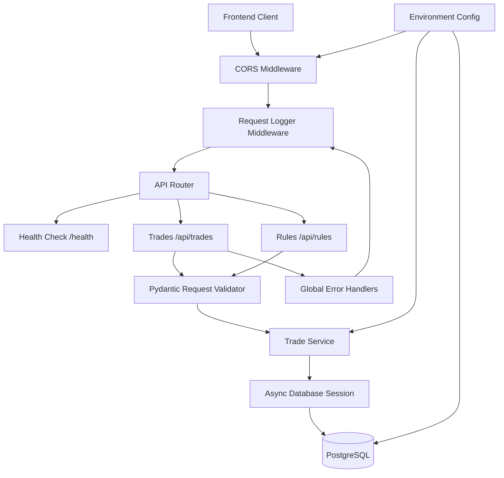
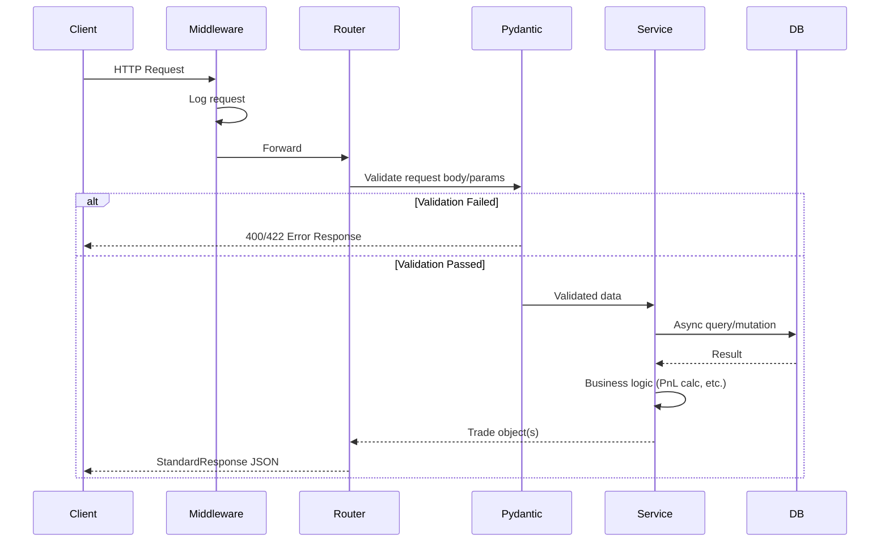

# Design Document: Backend API

## Overview

本设计文档描述了交易复盘系统的 FastAPI 后端服务的技术实现方案。该服务**基于 database-schema spec 中已定义的 Trade ORM 模型和枚举**，提供完整的 RESTful API 接口，支持交易记录的 CRUD 操作、规则库查询、高级查询过滤、分页排序、批量操作等功能。

> ⚠️ **重要**: 本 spec 中的所有 ORM 模型和枚举定义均引用自 `database-schema/design.md`，不重复定义。

### 核心技术栈

- **FastAPI**: 现代、高性能的 Python Web 框架，支持自动 API 文档生成
- **Pydantic v2**: 数据验证和序列化，提供类型安全和自动验证
- **SQLAlchemy 2.0+**: 异步 ORM（模型定义在 database-schema 中）
- **PostgreSQL**: 关系型数据库，存储交易记录
- **uvicorn**: ASGI 服务器，支持异步请求处理
- **pytest + Hypothesis**: 测试框架 + 属性测试

### 设计原则

1. **RESTful 设计**: 遵循 REST 架构风格，使用标准 HTTP 方法和状态码
2. **类型安全**: 使用 Pydantic 模型确保请求和响应的类型安全
3. **异步优先**: 所有 I/O 操作使用异步模式，提高并发性能
4. **依赖注入**: 使用 FastAPI 的依赖注入系统管理数据库会话
5. **模型复用**: ORM 模型和枚举直接从 database-schema 导入，单一数据源
6. **错误处理**: 统一的错误处理机制，提供清晰的中文错误信息

## Architecture

### 系统架构图



### 分层架构

```
backend/
├── app/
│   ├── main.py                    # FastAPI 入口、中间件、异常处理
│   ├── core/
│   │   ├── config.py              # pydantic-settings 环境变量
│   │   └── errors.py              # 自定义异常类
│   ├── db/
│   │   └── session.py             # 异步引擎 + get_db() 依赖注入
│   ├── models/                    # 来自 database-schema spec
│   │   ├── base.py                # DeclarativeBase
│   │   ├── enums.py               # 12 个枚举类型
│   │   └── trade.py               # Trade ORM 模型 (5 模块, ~40 字段)
│   ├── schemas/
│   │   ├── trade.py               # Pydantic 请求/响应模型
│   │   └── common.py              # 通用响应模型
│   ├── services/
│   │   └── trade_service.py       # 业务逻辑层
│   ├── api/
│   │   └── routes/
│   │       ├── health.py          # /health
│   │       ├── trades.py          # /api/trades CRUD
│   │       └── rules.py           # /api/rules 规则库
│   └── middleware/
│       └── logging.py             # 请求日志
├── alembic/                       # 数据库迁移
├── tests/                         # 测试
├── requirements.txt
├── Procfile
└── railway.toml
```

### 请求处理流程



## Components and Interfaces

### 1. Pydantic Schemas (`app/schemas/trade.py`)

请求/响应模型。**所有枚举引用自 `app/models/enums.py`**（database-schema 中定义）。

**TradeCreate** — 创建请求（对应 PRD 中的四步表单提交）:
```python
from uuid import UUID
from datetime import datetime
from typing import Optional, List
from pydantic import BaseModel, Field, model_validator
from app.models.enums import (
    AccountType, TradeCycle, MarketEnvironment, SectorStatus,
    PlanAdherence, StopLossDiscipline, ExitType, PsychologicalState,
    ResultType, ErrorLevel,
)

class TradeCreate(BaseModel):
    # 模块 1: 基础交易事实
    account_type: AccountType
    stock_code: str = Field(min_length=1, max_length=20)
    stock_name: Optional[str] = Field(None, max_length=100)
    trade_cycle: TradeCycle
    entry_date: datetime
    exit_date: Optional[datetime] = None
    position_size: float = Field(gt=0, le=100, description="仓位占比 (%)")
    entry_price: float = Field(gt=0)
    exit_price: Optional[float] = Field(None, gt=0)
    preset_stop_loss: Optional[float] = None
    preset_take_profit: Optional[float] = None
    slippage: Optional[float] = Field(None, ge=0)
    max_favorable_excursion: Optional[float] = None
    max_adverse_excursion: Optional[float] = None

    # 模块 2: 决策环境快照
    market_environment: Optional[MarketEnvironment] = None
    sector_status: Optional[SectorStatus] = None
    selection_dimension: Optional[List[str]] = None
    strategy_pattern: Optional[List[str]] = None
    volume_profile: Optional[str] = Field(None, max_length=500)
    thesis_statement: Optional[str] = None

    # 模块 3: 执行与心理评估
    plan_adherence: Optional[PlanAdherence] = None
    stop_loss_discipline: Optional[StopLossDiscipline] = None
    exit_type: Optional[ExitType] = None
    exit_reason: Optional[str] = None
    psychological_state: Optional[PsychologicalState] = None

    # 模块 4: 深度归因
    result_type: Optional[ResultType] = None
    error_level: Optional[ErrorLevel] = None
    environment_mismatch_flag: Optional[bool] = False
    permanent_exclusion_flag: Optional[bool] = False
    correct_action: str = Field(min_length=1, description="正确行为（必填）")

    @model_validator(mode='after')
    def validate_dates(self) -> 'TradeCreate':
        if self.exit_date and self.entry_date:
            if self.exit_date < self.entry_date:
                raise ValueError('exit_date（卖出时间）必须晚于 entry_date（买入时间）')
        return self
```

**TradeUpdate** — 部分更新（所有字段可选，附带 version 用于乐观锁）:
```python
class TradeUpdate(BaseModel):
    account_type: Optional[AccountType] = None
    stock_code: Optional[str] = Field(None, min_length=1, max_length=20)
    stock_name: Optional[str] = None
    trade_cycle: Optional[TradeCycle] = None
    entry_date: Optional[datetime] = None
    exit_date: Optional[datetime] = None
    position_size: Optional[float] = Field(None, gt=0, le=100)
    entry_price: Optional[float] = Field(None, gt=0)
    exit_price: Optional[float] = Field(None, gt=0)
    preset_stop_loss: Optional[float] = None
    preset_take_profit: Optional[float] = None
    slippage: Optional[float] = None
    max_favorable_excursion: Optional[float] = None
    max_adverse_excursion: Optional[float] = None
    market_environment: Optional[MarketEnvironment] = None
    sector_status: Optional[SectorStatus] = None
    selection_dimension: Optional[List[str]] = None
    strategy_pattern: Optional[List[str]] = None
    volume_profile: Optional[str] = None
    thesis_statement: Optional[str] = None
    plan_adherence: Optional[PlanAdherence] = None
    stop_loss_discipline: Optional[StopLossDiscipline] = None
    exit_type: Optional[ExitType] = None
    exit_reason: Optional[str] = None
    psychological_state: Optional[PsychologicalState] = None
    result_type: Optional[ResultType] = None
    error_level: Optional[ErrorLevel] = None
    environment_mismatch_flag: Optional[bool] = None
    permanent_exclusion_flag: Optional[bool] = None
    correct_action: Optional[str] = Field(None, min_length=1)

    # 乐观锁
    version: int = Field(description="当前版本号，用于并发控制")
```

**TradeResponse** — 响应模型（包含系统自动管理的字段）:
```python
class TradeResponse(BaseModel):
    # 模块 0: 系统字段
    id: UUID
    user_id: str
    created_at: datetime
    updated_at: datetime
    deleted_at: Optional[datetime] = None
    version: int
    llm_analysis_status: str
    llm_raw_log: Optional[dict] = None

    # 模块 1-4: 业务字段（与 TradeCreate 一致）
    account_type: str
    stock_code: str
    stock_name: Optional[str] = None
    trade_cycle: str
    entry_date: datetime
    exit_date: Optional[datetime] = None
    position_size: float
    entry_price: float
    exit_price: Optional[float] = None
    preset_stop_loss: Optional[float] = None
    preset_take_profit: Optional[float] = None
    slippage: Optional[float] = None
    max_favorable_excursion: Optional[float] = None
    max_adverse_excursion: Optional[float] = None
    pnl_amount: Optional[float] = None
    pnl_ratio: Optional[float] = None
    pnl_flag: Optional[str] = None
    market_environment: Optional[str] = None
    sector_status: Optional[str] = None
    selection_dimension: Optional[List[str]] = None
    strategy_pattern: Optional[List[str]] = None
    volume_profile: Optional[str] = None
    thesis_statement: Optional[str] = None
    plan_adherence: Optional[str] = None
    stop_loss_discipline: Optional[str] = None
    exit_type: Optional[str] = None
    exit_reason: Optional[str] = None
    psychological_state: Optional[str] = None
    result_type: Optional[str] = None
    error_level: Optional[str] = None
    environment_mismatch_flag: Optional[bool] = None
    permanent_exclusion_flag: Optional[bool] = None
    correct_action: str
    llm_action_item: Optional[str] = None

    model_config = ConfigDict(from_attributes=True)
```

### 2. Common Response Models (`app/schemas/common.py`)

```python
from typing import TypeVar, Generic, Optional, List, Dict, Any
from pydantic import BaseModel

T = TypeVar("T")

class StandardResponse(BaseModel, Generic[T]):
    success: bool
    data: Optional[T] = None
    message: str
    error: Optional[Dict[str, Any]] = None

class PaginationInfo(BaseModel):
    total: int
    page: int
    page_size: int
    total_pages: int

class PaginatedResponse(BaseModel, Generic[T]):
    success: bool
    data: List[T]
    pagination: PaginationInfo
    message: str
```

### 3. Query Parameters

```python
class TradeFilters(BaseModel):
    stock_code: Optional[str] = None
    start_date: Optional[datetime] = None
    end_date: Optional[datetime] = None
    market_environment: Optional[MarketEnvironment] = None
    result_type: Optional[ResultType] = None
    pnl_flag: Optional[PnLFlag] = None
    account_type: Optional[AccountType] = None
    trade_cycle: Optional[TradeCycle] = None

class PaginationParams(BaseModel):
    page: int = Field(default=1, ge=1)
    page_size: int = Field(default=20, ge=1, le=100)

class SortParams(BaseModel):
    sort_by: str = Field(default="entry_date")
    order: str = Field(default="desc", pattern="^(asc|desc)$")
```

### 4. API Router — Trades (`app/api/routes/trades.py`)

**端点列表**:

| Method | Path | 说明 |
|--------|------|------|
| `POST` | `/api/trades` | 创建单条交易记录 |
| `POST` | `/api/trades/bulk` | 批量创建交易记录 |
| `GET` | `/api/trades` | 查询列表（过滤+分页+排序） |
| `GET` | `/api/trades/{id}` | 获取单条记录 |
| `PUT` | `/api/trades/{id}` | 更新记录（乐观锁） |
| `DELETE` | `/api/trades/{id}` | 软删除记录 |
| `POST` | `/api/trades/{id}/restore` | 恢复已删除记录 |

### 5. API Router — Rules (`app/api/routes/rules.py`)

动态规则库 API，聚合 trades 表中的标记数据，供前端规则库面板使用。

| Method | Path | 说明 |
|--------|------|------|
| `GET` | `/api/rules/exclusions` | 永久排除清单 (`permanent_exclusion_flag=true`) |
| `GET` | `/api/rules/correct-behaviors` | 正确行为清单 (`result_type=正确盈利`) |
| `GET` | `/api/rules/environment-mismatches` | 环境错配提醒 (`environment_mismatch_flag=true`) |
| `GET` | `/api/rules/summary` | 规则库汇总统计 |

### 6. Trade Service (`app/services/trade_service.py`)

```python
class TradeService:
    def __init__(self, db: AsyncSession):
        self.db = db

    async def create_trade(self, user_id: str, data: TradeCreate) -> Trade:
        """创建交易记录，自动计算 PnL、设置 pnl_flag"""

    async def get_trades(
        self, user_id: str,
        filters: TradeFilters,
        pagination: PaginationParams,
        sort: SortParams,
    ) -> tuple[list[Trade], int]:
        """查询列表（自动排除软删除），返回 (records, total_count)"""

    async def get_trade_by_id(self, user_id: str, trade_id: UUID) -> Trade:
        """获取单条记录（排除已删除），不存在则抛 TradeNotFoundError"""

    async def update_trade(
        self, user_id: str, trade_id: UUID, data: TradeUpdate
    ) -> Trade:
        """乐观锁更新，version 不匹配则抛 OptimisticLockError"""

    async def soft_delete_trade(self, user_id: str, trade_id: UUID) -> None:
        """软删除"""

    async def restore_trade(self, user_id: str, trade_id: UUID) -> Trade:
        """恢复"""

    async def bulk_create_trades(
        self, user_id: str, data_list: list[TradeCreate]
    ) -> tuple[list[Trade], list[dict]]:
        """批量创建，返回 (successes, failures)"""

    def calculate_pnl(self, trade: Trade) -> None:
        """计算 pnl_amount, pnl_ratio, pnl_flag"""
        if trade.exit_price and trade.entry_price and trade.position_size:
            slippage = trade.slippage or 0.0
            trade.pnl_amount = (
                (trade.exit_price - trade.entry_price) * trade.position_size - slippage
            )
            trade.pnl_ratio = (
                trade.pnl_amount / (trade.entry_price * trade.position_size) * 100
            )

    # ── 规则库查询 ──
    async def get_permanent_exclusions(self, user_id: str) -> list[Trade]:
        """永久排除清单"""

    async def get_correct_behaviors(self, user_id: str) -> list[Trade]:
        """正确行为清单"""

    async def get_environment_mismatches(self, user_id: str) -> list[Trade]:
        """环境错配提醒"""
```

### 7. Database Session (`app/db/session.py`)

与 database-schema 设计一致，使用异步引擎:

```python
from sqlalchemy.ext.asyncio import create_async_engine, AsyncSession, async_sessionmaker

engine = create_async_engine(
    settings.DATABASE_URL,  # postgresql+asyncpg://...
    echo=(settings.LOG_LEVEL == "DEBUG"),
    pool_pre_ping=True,
    pool_size=10,
    max_overflow=20,
)

AsyncSessionLocal = async_sessionmaker(
    engine, class_=AsyncSession, expire_on_commit=False
)

async def get_db() -> AsyncGenerator[AsyncSession, None]:
    async with AsyncSessionLocal() as session:
        try:
            yield session
            await session.commit()
        except Exception:
            await session.rollback()
            raise
        finally:
            await session.close()
```

### 8. Error Handlers (`app/core/errors.py`)

```python
class TradeNotFoundError(Exception):
    def __init__(self, trade_id: UUID):
        self.trade_id = trade_id
        super().__init__(f"交易记录不存在: {trade_id}")

class OptimisticLockError(Exception):
    def __init__(self, expected: int, actual: int):
        self.expected = expected
        self.actual = actual
        super().__init__(f"版本冲突: 期望 {expected}, 实际 {actual}")

class BusinessValidationError(Exception):
    def __init__(self, message: str, field: Optional[str] = None):
        self.field = field
        super().__init__(message)
```

异常处理器注册在 `main.py`:
- `TradeNotFoundError` → 404
- `OptimisticLockError` → 409
- `BusinessValidationError` → 422
- `RequestValidationError` → 400
- `Exception` → 500 (不暴露内部细节)

### 9. Configuration (`app/core/config.py`)

```python
class Settings(BaseSettings):
    DATABASE_URL: str
    ALLOWED_ORIGINS: str = "http://localhost:3000"
    PORT: int = 8000
    LOG_LEVEL: str = "INFO"
    LLM_API_KEY: str = ""
    LLM_API_BASE: str = "https://api.openai.com/v1"
    LLM_MODEL: str = "gpt-4"
    API_VERSION: str = "1.0.0"

    @property
    def cors_origins(self) -> list[str]:
        return [o.strip() for o in self.ALLOWED_ORIGINS.split(",")]

    model_config = SettingsConfigDict(env_file=".env", case_sensitive=True)
```

## Correctness Properties

### Property 1: Trade Creation with Valid Data
*For any* valid trade data with all required fields, creating via `POST /api/trades` should return 201, persist to DB with UUID primary key, and respond with `success=true`.
**Validates: Requirements 1.1, 1.2, 1.8**

### Property 2: Date Validation
*For any* trade where `exit_date < entry_date`, the API should return 422.
**Validates: Requirements 1.5**

### Property 3: PnL Calculation
*For any* trade with `entry_price`, `exit_price`, `position_size`, and `slippage`:
- `pnl_amount = (exit_price - entry_price) * position_size - slippage`
- `pnl_ratio = pnl_amount / (entry_price * position_size) * 100`
- `pnl_flag` auto-set based on `pnl_amount`
**Validates: Requirements 1.7, 4.6**

### Property 4: Query Filter AND Logic
*For any* filter combination, all returned records satisfy ALL conditions.
**Validates: Requirements 2.4-2.9**

### Property 5: Pagination Limit
*For any* `page_size > 100`, actual page size clamped to 100.
**Validates: Requirements 2.3**

### Property 6: Optimistic Lock
*For any* update with version mismatch, return 409 Conflict.
**Validates: Requirements 4.3**

### Property 7: Soft Delete Invisibility
*For any* soft-deleted record, `GET /api/trades/{id}` returns 404.
**Validates: Requirements 5.1, 5.3, 3.3**

### Property 8: Restore Reversibility
*For any* soft-deleted record, `POST /api/trades/{id}/restore` clears `deleted_at` and makes the record queryable again.
**Validates: Requirements 5.4, 5.6**

### Property 9: Response Format Consistency
*For any* successful operation, response has `success=true, data, message`. For errors, `success=false, error, message`.
**Validates: Requirements 7.1, 7.2**

### Property 10: Rules Library Data Correctness
*For any* call to `/api/rules/exclusions`, all returned records have `permanent_exclusion_flag=true`. Similarly for other rules endpoints.
**Validates: Requirements 16 (new)**

## Error Handling

### HTTP Status Codes

| Code | 场景 | 示例 |
|------|------|------|
| 200 | 成功 (查询/更新/恢复) | — |
| 201 | 创建成功 | — |
| 204 | 删除成功 | — |
| 400 | 请求数据验证失败 | 价格为负、枚举值无效 |
| 404 | 资源不存在 | ID 不存在或已软删除 |
| 409 | 乐观锁冲突 | version 不匹配 |
| 422 | 业务逻辑错误 | exit_date < entry_date |
| 500 | 服务器内部错误 | 不暴露细节 |
| 503 | 服务不可用 | 数据库连接失败 |

### Error Response Structure

```json
{
    "success": false,
    "message": "交易记录不存在",
    "error": {
        "code": "TRADE_NOT_FOUND",
        "details": {"trade_id": "550e8400-e29b-41d4-a716-446655440000"}
    }
}
```

## Testing Strategy

### 测试框架
- **pytest + pytest-asyncio**: 异步测试
- **Hypothesis**: 属性测试 (≥100 迭代)
- **httpx.AsyncClient**: API 集成测试
- **pytest-cov**: 覆盖率 (目标 ≥ 80%)

### 测试组织
```
tests/
├── conftest.py                       # 共享 fixtures (DB session, client)
├── unit/
│   ├── test_schemas.py               # Pydantic 模型验证
│   └── test_services.py              # Service 层逻辑
├── integration/
│   ├── test_api_trades.py            # /api/trades CRUD
│   ├── test_api_rules.py             # /api/rules 规则库
│   └── test_health.py                # /health
└── properties/
    ├── test_trade_properties.py      # 交易 CRUD 属性
    ├── test_query_properties.py      # 查询过滤属性
    └── test_validation_properties.py # 验证属性
```

### 属性测试数据生成策略

使用 database-schema 中定义的枚举:

```python
from hypothesis import strategies as st
from app.models.enums import AccountType, TradeCycle, MarketEnvironment

@st.composite
def valid_trade_data(draw):
    return {
        "account_type": draw(st.sampled_from([e.value for e in AccountType])),
        "stock_code": draw(st.text(min_size=1, max_size=10, alphabet="ABCDEFGHIJKLMNOPQRSTUVWXYZ0123456789")),
        "trade_cycle": draw(st.sampled_from([e.value for e in TradeCycle])),
        "entry_date": draw(st.datetimes(min_value=datetime(2020,1,1), max_value=datetime(2025,12,31))).isoformat(),
        "entry_price": draw(st.floats(min_value=0.01, max_value=10000)),
        "position_size": draw(st.floats(min_value=0.1, max_value=100)),
        "correct_action": draw(st.text(min_size=1, max_size=200)),
    }
```
