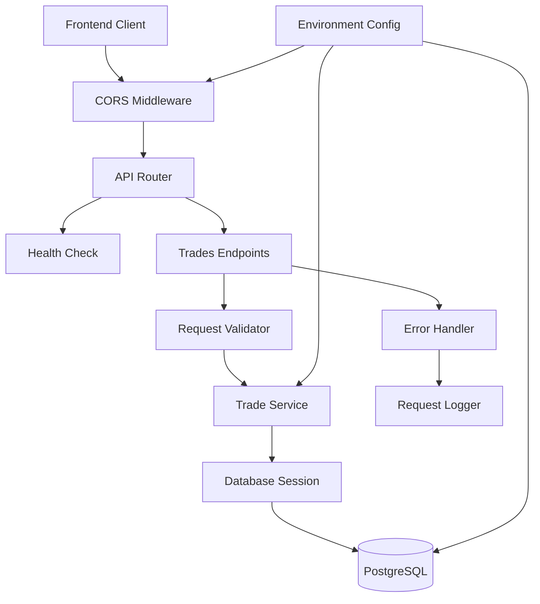
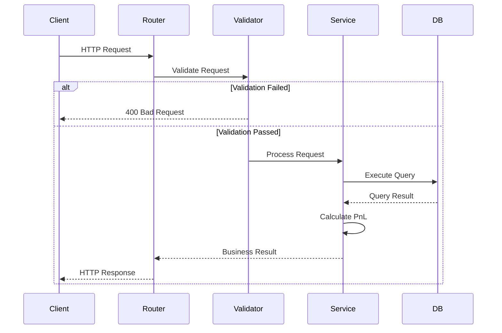

# Design Document: Backend API

## Overview

本设计文档描述了交易复盘系统的 FastAPI 后端服务的技术实现方案。该服务基于已完成的 database-schema，提供完整的 RESTful API 接口，支持交易记录的 CRUD 操作、高级查询过滤、分页排序、批量操作等功能。

### 核心技术栈

- **FastAPI**: 现代、高性能的 Python Web 框架，支持自动 API 文档生成
- **Pydantic v2**: 数据验证和序列化，提供类型安全和自动验证
- **SQLAlchemy 2.0+**: 异步 ORM，支持高性能数据库操作
- **PostgreSQL**: 关系型数据库，存储交易记录
- **uvicorn**: ASGI 服务器，支持异步请求处理
- **pytest**: 测试框架，支持单元测试和集成测试

### 设计原则

1. **RESTful 设计**: 遵循 REST 架构风格，使用标准 HTTP 方法和状态码
2. **类型安全**: 使用 Pydantic 模型确保请求和响应的类型安全
3. **异步优先**: 所有 I/O 操作使用异步模式，提高并发性能
4. **依赖注入**: 使用 FastAPI 的依赖注入系统管理数据库会话和其他依赖
5. **错误处理**: 统一的错误处理机制，提供清晰的错误信息
6. **可测试性**: 设计易于测试的代码结构，支持单元测试和集成测试

## Architecture

### 系统架构图



### 分层架构

系统采用经典的三层架构：

1. **表现层 (Presentation Layer)**
   - API 路由定义
   - 请求/响应模型
   - 中间件（CORS、日志记录）

2. **业务逻辑层 (Business Logic Layer)**
   - Trade Service: 交易记录业务逻辑
   - 数据验证和转换
   - 业务规则实现（如 PnL 计算）

3. **数据访问层 (Data Access Layer)**
   - SQLAlchemy ORM 模型
   - 数据库会话管理
   - 查询构建器

### 请求处理流程



## Components and Interfaces

### 1. API Router (`app/api/routes/trades.py`)

负责定义所有交易记录相关的 API 端点。

**端点列表**:
- `POST /api/trades` - 创建单条交易记录
- `POST /api/trades/bulk` - 批量创建交易记录
- `GET /api/trades` - 查询交易记录列表（支持过滤、分页、排序）
- `GET /api/trades/{id}` - 获取单条交易记录
- `PUT /api/trades/{id}` - 更新交易记录
- `DELETE /api/trades/{id}` - 软删除交易记录
- `POST /api/trades/{id}/restore` - 恢复已删除的记录

### 2. Request/Response Models (`app/models/schemas.py`)

使用 Pydantic v2 定义所有请求和响应模型。

**TradeCreate** (创建请求):
```python
class TradeCreate(BaseModel):
    stock_code: str = Field(min_length=1, max_length=20)
    entry_date: date
    entry_price: Decimal = Field(gt=0)
    position_size: int = Field(ge=0, le=100)
    correct_action: CorrectAction
    actual_action: Optional[ActualAction] = None
    exit_date: Optional[date] = None
    exit_price: Optional[Decimal] = Field(None, gt=0)
    market_environment: Optional[MarketEnvironment] = None
    notes: Optional[str] = Field(None, max_length=1000)
    
    @model_validator(mode='after')
    def validate_dates(self) -> 'TradeCreate':
        if self.exit_date and self.entry_date:
            if self.exit_date < self.entry_date:
                raise ValueError('exit_date must be >= entry_date')
        return self
```

**TradeUpdate** (更新请求):
```python
class TradeUpdate(BaseModel):
    stock_code: Optional[str] = Field(None, min_length=1, max_length=20)
    entry_date: Optional[date] = None
    entry_price: Optional[Decimal] = Field(None, gt=0)
    position_size: Optional[int] = Field(None, ge=0, le=100)
    correct_action: Optional[CorrectAction] = None
    actual_action: Optional[ActualAction] = None
    exit_date: Optional[date] = None
    exit_price: Optional[Decimal] = Field(None, gt=0)
    market_environment: Optional[MarketEnvironment] = None
    notes: Optional[str] = Field(None, max_length=1000)
    version: Optional[int] = None
```

**TradeResponse** (响应模型):
```python
class TradeResponse(BaseModel):
    id: int
    stock_code: str
    entry_date: date
    entry_price: Decimal
    position_size: int
    correct_action: CorrectAction
    actual_action: Optional[ActualAction]
    exit_date: Optional[date]
    exit_price: Optional[Decimal]
    pnl_amount: Optional[Decimal]
    pnl_percentage: Optional[Decimal]
    result_type: Optional[ResultType]
    pnl_flag: Optional[PnLFlag]
    market_environment: Optional[MarketEnvironment]
    notes: Optional[str]
    version: int
    created_at: datetime
    updated_at: datetime
    deleted_at: Optional[datetime]
    
    model_config = ConfigDict(from_attributes=True)
```

**StandardResponse** (统一响应格式):
```python
class StandardResponse(BaseModel, Generic[T]):
    success: bool
    data: Optional[T] = None
    message: str
    error: Optional[Dict[str, Any]] = None

class PaginationInfo(BaseModel):
    total: int
    page: int
    page_size: int
    total_pages: int

class PaginatedResponse(BaseModel, Generic[T]):
    success: bool
    data: List[T]
    pagination: PaginationInfo
    message: str
```

### 3. Trade Service (`app/services/trade_service.py`)

封装所有交易记录相关的业务逻辑。

**核心方法**:
```python
class TradeService:
    def __init__(self, db: AsyncSession):
        self.db = db
    
    async def create_trade(self, trade_data: TradeCreate) -> Trade:
        """创建交易记录并计算 PnL"""
        
    async def get_trades(
        self, 
        filters: TradeFilters,
        pagination: PaginationParams,
        sort: SortParams
    ) -> Tuple[List[Trade], int]:
        """查询交易记录列表，返回记录和总数"""
        
    async def get_trade_by_id(self, trade_id: int) -> Optional[Trade]:
        """获取单条交易记录（排除已删除）"""
        
    async def update_trade(
        self, 
        trade_id: int, 
        trade_data: TradeUpdate
    ) -> Trade:
        """更新交易记录，支持乐观锁"""
        
    async def soft_delete_trade(self, trade_id: int) -> None:
        """软删除交易记录"""
        
    async def restore_trade(self, trade_id: int) -> Trade:
        """恢复已删除的交易记录"""
        
    async def bulk_create_trades(
        self, 
        trades_data: List[TradeCreate]
    ) -> Tuple[List[Trade], List[Dict]]:
        """批量创建交易记录，返回成功和失败列表"""
        
    def calculate_pnl(self, trade: Trade) -> None:
        """计算 PnL 并更新相关字段"""
```

### 4. Database Session Management (`app/db/session.py`)

管理数据库连接和会话生命周期。

```python
from sqlalchemy.ext.asyncio import create_async_engine, AsyncSession, async_sessionmaker

engine = create_async_engine(
    settings.DATABASE_URL,
    echo=settings.LOG_LEVEL == "DEBUG",
    pool_pre_ping=True,
    pool_size=10,
    max_overflow=20
)

AsyncSessionLocal = async_sessionmaker(
    engine,
    class_=AsyncSession,
    expire_on_commit=False
)

async def get_db() -> AsyncSession:
    """依赖注入函数，提供数据库会话"""
    async with AsyncSessionLocal() as session:
        try:
            yield session
            await session.commit()
        except Exception:
            await session.rollback()
            raise
        finally:
            await session.close()
```

### 5. Configuration Management (`app/core/config.py`)

集中管理所有环境变量配置。

```python
from pydantic_settings import BaseSettings

class Settings(BaseSettings):
    DATABASE_URL: str
    ALLOWED_ORIGINS: str = "http://localhost:3000"
    PORT: int = 8000
    LOG_LEVEL: str = "INFO"
    API_VERSION: str = "1.0.0"
    
    @property
    def cors_origins(self) -> List[str]:
        return [origin.strip() for origin in self.ALLOWED_ORIGINS.split(",")]
    
    model_config = SettingsConfigDict(
        env_file=".env",
        case_sensitive=True
    )

settings = Settings()
```

### 6. Error Handlers (`app/core/errors.py`)

统一的异常处理机制。

```python
class TradeNotFoundError(Exception):
    """交易记录不存在"""
    pass

class OptimisticLockError(Exception):
    """乐观锁版本冲突"""
    pass

class BusinessValidationError(Exception):
    """业务逻辑验证失败"""
    pass

@app.exception_handler(TradeNotFoundError)
async def trade_not_found_handler(request: Request, exc: TradeNotFoundError):
    return JSONResponse(
        status_code=404,
        content=StandardResponse(
            success=False,
            message="Trade record not found",
            error={"detail": str(exc)}
        ).model_dump()
    )
```

### 7. Middleware (`app/middleware/`)

**CORS Middleware**:
```python
app.add_middleware(
    CORSMiddleware,
    allow_origins=settings.cors_origins,
    allow_credentials=True,
    allow_methods=["GET", "POST", "PUT", "DELETE"],
    allow_headers=["Content-Type", "Authorization"],
)
```

**Request Logging Middleware**:
```python
@app.middleware("http")
async def log_requests(request: Request, call_next):
    start_time = time.time()
    logger.info(f"Request: {request.method} {request.url.path}")
    
    response = await call_next(request)
    
    process_time = time.time() - start_time
    logger.info(
        f"Response: {response.status_code} "
        f"(took {process_time:.3f}s)"
    )
    return response
```

## Data Models

### ORM Models (`app/models/trade.py`)

基于 database-schema 定义的 SQLAlchemy 模型。

```python
from sqlalchemy import Column, Integer, String, Numeric, Date, DateTime, Enum, Text
from sqlalchemy.ext.asyncio import AsyncAttrs
from sqlalchemy.orm import DeclarativeBase
from datetime import datetime

class Base(AsyncAttrs, DeclarativeBase):
    pass

class Trade(Base):
    __tablename__ = "trades"
    
    id = Column(Integer, primary_key=True, autoincrement=True)
    stock_code = Column(String(20), nullable=False, index=True)
    entry_date = Column(Date, nullable=False, index=True)
    entry_price = Column(Numeric(10, 2), nullable=False)
    position_size = Column(Integer, nullable=False)
    correct_action = Column(Enum(CorrectAction), nullable=False)
    actual_action = Column(Enum(ActualAction), nullable=True)
    exit_date = Column(Date, nullable=True)
    exit_price = Column(Numeric(10, 2), nullable=True)
    pnl_amount = Column(Numeric(12, 2), nullable=True)
    pnl_percentage = Column(Numeric(6, 2), nullable=True)
    result_type = Column(Enum(ResultType), nullable=True, index=True)
    pnl_flag = Column(Enum(PnLFlag), nullable=True, index=True)
    market_environment = Column(Enum(MarketEnvironment), nullable=True, index=True)
    notes = Column(Text, nullable=True)
    version = Column(Integer, nullable=False, default=1)
    created_at = Column(DateTime, nullable=False, default=datetime.utcnow)
    updated_at = Column(DateTime, nullable=False, default=datetime.utcnow, onupdate=datetime.utcnow)
    deleted_at = Column(DateTime, nullable=True, index=True)
```

### Enum Types

```python
from enum import Enum

class CorrectAction(str, Enum):
    BUY = "buy"
    SELL = "sell"
    HOLD = "hold"

class ActualAction(str, Enum):
    BUY = "buy"
    SELL = "sell"
    HOLD = "hold"

class ResultType(str, Enum):
    CORRECT = "correct"
    INCORRECT = "incorrect"
    PARTIAL = "partial"

class PnLFlag(str, Enum):
    PROFIT = "profit"
    LOSS = "loss"
    BREAKEVEN = "breakeven"

class MarketEnvironment(str, Enum):
    BULL = "bull"
    BEAR = "bear"
    SIDEWAYS = "sideways"
    VOLATILE = "volatile"
```

### Query Filters and Parameters

```python
class TradeFilters(BaseModel):
    stock_code: Optional[str] = None
    start_date: Optional[date] = None
    end_date: Optional[date] = None
    market_environment: Optional[MarketEnvironment] = None
    result_type: Optional[ResultType] = None
    pnl_flag: Optional[PnLFlag] = None

class PaginationParams(BaseModel):
    page: int = Field(default=1, ge=1)
    page_size: int = Field(default=20, ge=1, le=100)

class SortParams(BaseModel):
    sort_by: str = Field(default="entry_date")
    order: str = Field(default="desc", pattern="^(asc|desc)$")
```


## Correctness Properties

*A property is a characteristic or behavior that should hold true across all valid executions of a system—essentially, a formal statement about what the system should do. Properties serve as the bridge between human-readable specifications and machine-verifiable correctness guarantees.*

### Property 1: Trade Creation with Valid Data

*For any* valid trade data (with all required fields and valid values), creating a trade through the API should result in a 201 status code, a record in the database, and a response containing success=true with the complete trade data.

**Validates: Requirements 1.1, 1.2, 1.8**

### Property 2: Date Validation Rejects Invalid Ranges

*For any* trade data where exit_date is earlier than entry_date, the API should reject the request with a 422 status code and return an error message indicating the date validation failure.

**Validates: Requirements 1.5, 8.4**

### Property 3: PnL Calculation Correctness

*For any* trade with both entry and exit data (entry_price, exit_price, position_size, correct_action), the calculated pnl_amount and pnl_percentage should match the formula:
- For BUY: pnl_amount = (exit_price - entry_price) * position_size
- For SELL: pnl_amount = (entry_price - exit_price) * position_size
- pnl_percentage = (pnl_amount / (entry_price * position_size)) * 100

This should hold for both create and update operations.

**Validates: Requirements 1.7, 4.6**

### Property 4: Query Filter Correctness

*For any* combination of query filters (stock_code, date range, market_environment, result_type, pnl_flag), all returned records should satisfy ALL specified filter conditions (AND logic).

**Validates: Requirements 2.4, 2.5, 2.6, 2.7, 2.8, 2.9**

### Property 5: Pagination Limit Enforcement

*For any* query with page_size greater than 100, the API should limit the actual page size to 100 and return at most 100 records.

**Validates: Requirements 2.3**

### Property 6: Sort Order Correctness

*For any* sortable field and sort order (asc/desc), the returned records should be ordered according to the specified field and direction, with consistent ordering for equal values.

**Validates: Requirements 2.11**

### Property 7: Response Format Consistency - Success

*For any* successful API operation, the response should contain a JSON object with success=true, a data field containing the result, and a message field with a descriptive message.

**Validates: Requirements 7.1, 1.8, 3.4, 4.8**

### Property 8: Response Format Consistency - Error

*For any* failed API operation, the response should contain a JSON object with success=false, an error field containing error details, and a message field with a descriptive message.

**Validates: Requirements 7.2, 7.4, 8.1**

### Property 9: Pagination Response Format

*For any* list query response, the response should include a pagination object containing total (total records), page (current page), page_size (records per page), and total_pages (calculated as ceil(total / page_size)).

**Validates: Requirements 7.3, 2.12**

### Property 10: Trade Retrieval by ID

*For any* trade that exists in the database and is not soft-deleted, requesting it by ID should return a 200 status code and the complete trade data.

**Validates: Requirements 3.1**

### Property 11: Soft Delete Behavior

*For any* existing trade, soft deleting it should set the deleted_at timestamp (not physically delete the record), and subsequent GET requests for that trade should return 404 as if it doesn't exist.

**Validates: Requirements 5.1, 5.3, 3.3**

### Property 12: Restore Deleted Trade

*For any* soft-deleted trade, restoring it should clear the deleted_at timestamp and make the trade retrievable again through normal queries.

**Validates: Requirements 5.4, 5.6**

### Property 13: Update with Valid Data

*For any* existing trade and valid update data, updating the trade should return 200 status code, apply all specified changes, recalculate PnL if relevant fields changed, increment the version field, and update the updated_at timestamp.

**Validates: Requirements 4.1, 4.5, 4.6, 4.7**

### Property 14: Optimistic Lock Version Conflict

*For any* existing trade, if an update request includes a version field that doesn't match the current database version, the API should return 409 status code with a conflict error message.

**Validates: Requirements 4.3, 8.3**

### Property 15: Bulk Create Success

*For any* array of valid trade data, bulk creating them should result in all trades being created in the database, and the response should include success=true, a count of successful creates, and the list of created trades.

**Validates: Requirements 6.1, 6.5**

### Property 16: Bulk Create Partial Failure

*For any* array of trade data containing both valid and invalid records, the bulk create should return a response listing which records succeeded and which failed with their respective error messages, without rolling back successful creates.

**Validates: Requirements 6.2**

### Property 17: Bulk Create Transaction Rollback

*For any* bulk create operation, if a database error occurs during the transaction (not validation errors), all changes should be rolled back and no trades should be created.

**Validates: Requirements 6.4**

### Property 18: CORS Origin Parsing

*For any* ALLOWED_ORIGINS environment variable value containing comma-separated origins, the CORS middleware should allow requests from all specified origins.

**Validates: Requirements 9.3**

### Property 19: Database Session Cleanup

*For any* API request that uses a database session, the session should be automatically closed after the request completes, regardless of whether the request succeeded or failed.

**Validates: Requirements 12.3, 12.4**

### Property 20: Database Transaction Rollback on Error

*For any* API request that modifies data, if an exception occurs during processing, the database transaction should be rolled back before the session is closed.

**Validates: Requirements 12.4**


## Error Handling

### Error Response Structure

所有错误响应遵循统一的格式：

```python
{
    "success": false,
    "message": "Human-readable error message",
    "error": {
        "code": "ERROR_CODE",
        "details": {...}  # Optional detailed error information
    }
}
```

### HTTP Status Codes

| Status Code | 使用场景 | 示例 |
|------------|---------|------|
| 400 Bad Request | 请求数据验证失败 | 价格为负数、枚举值无效 |
| 404 Not Found | 请求的资源不存在 | 交易记录 ID 不存在、已被软删除 |
| 409 Conflict | 乐观锁版本冲突 | 更新时版本号不匹配 |
| 422 Unprocessable Entity | 业务逻辑验证失败 | exit_date 早于 entry_date |
| 500 Internal Server Error | 未预期的服务器错误 | 数据库连接失败、未捕获的异常 |
| 503 Service Unavailable | 服务不可用 | 健康检查失败 |

### Custom Exception Classes

```python
class TradeNotFoundError(Exception):
    """交易记录不存在或已被删除"""
    def __init__(self, trade_id: int):
        self.trade_id = trade_id
        super().__init__(f"Trade with ID {trade_id} not found")

class OptimisticLockError(Exception):
    """乐观锁版本冲突"""
    def __init__(self, expected: int, actual: int):
        self.expected = expected
        self.actual = actual
        super().__init__(
            f"Version conflict: expected {expected}, got {actual}"
        )

class BusinessValidationError(Exception):
    """业务逻辑验证失败"""
    def __init__(self, message: str, field: Optional[str] = None):
        self.field = field
        super().__init__(message)

class DatabaseError(Exception):
    """数据库操作错误"""
    pass
```

### Exception Handlers

```python
@app.exception_handler(TradeNotFoundError)
async def trade_not_found_handler(request: Request, exc: TradeNotFoundError):
    return JSONResponse(
        status_code=404,
        content={
            "success": False,
            "message": str(exc),
            "error": {
                "code": "TRADE_NOT_FOUND",
                "details": {"trade_id": exc.trade_id}
            }
        }
    )

@app.exception_handler(OptimisticLockError)
async def optimistic_lock_handler(request: Request, exc: OptimisticLockError):
    return JSONResponse(
        status_code=409,
        content={
            "success": False,
            "message": "Version conflict detected",
            "error": {
                "code": "VERSION_CONFLICT",
                "details": {
                    "expected_version": exc.expected,
                    "actual_version": exc.actual
                }
            }
        }
    )

@app.exception_handler(BusinessValidationError)
async def business_validation_handler(request: Request, exc: BusinessValidationError):
    return JSONResponse(
        status_code=422,
        content={
            "success": False,
            "message": str(exc),
            "error": {
                "code": "BUSINESS_VALIDATION_ERROR",
                "details": {"field": exc.field} if exc.field else {}
            }
        }
    )

@app.exception_handler(RequestValidationError)
async def validation_exception_handler(request: Request, exc: RequestValidationError):
    return JSONResponse(
        status_code=400,
        content={
            "success": False,
            "message": "Request validation failed",
            "error": {
                "code": "VALIDATION_ERROR",
                "details": exc.errors()
            }
        }
    )

@app.exception_handler(Exception)
async def general_exception_handler(request: Request, exc: Exception):
    logger.error(f"Unhandled exception: {exc}", exc_info=True)
    return JSONResponse(
        status_code=500,
        content={
            "success": False,
            "message": "An internal server error occurred",
            "error": {
                "code": "INTERNAL_SERVER_ERROR"
            }
        }
    )
```

### Error Logging

所有错误都应该被记录，包括：
- 错误类型和消息
- 请求路径和方法
- 请求参数（排除敏感信息）
- 完整的堆栈跟踪（仅用于 500 错误）
- 时间戳和请求 ID

```python
logger.error(
    "Trade operation failed",
    extra={
        "error_type": type(exc).__name__,
        "error_message": str(exc),
        "request_path": request.url.path,
        "request_method": request.method,
        "trade_id": trade_id,
        "timestamp": datetime.utcnow().isoformat()
    },
    exc_info=True if isinstance(exc, Exception) else False
)
```

## Testing Strategy

### 测试方法概述

本项目采用双重测试策略，结合单元测试和基于属性的测试（Property-Based Testing, PBT）：

- **单元测试**: 验证特定示例、边界条件和错误处理
- **属性测试**: 验证跨所有输入的通用属性

两种测试方法互补，共同确保全面的测试覆盖。

### 测试框架和工具

- **pytest**: 主测试框架
- **pytest-asyncio**: 异步测试支持
- **Hypothesis**: 基于属性的测试库
- **httpx**: 异步 HTTP 客户端，用于 API 测试
- **pytest-cov**: 代码覆盖率报告
- **faker**: 生成测试数据

### 单元测试策略

单元测试应专注于：

1. **特定示例**: 验证核心功能的具体用例
   - 创建一个有效的交易记录
   - 查询空数据库返回空列表
   - 使用默认分页参数

2. **边界条件**: 测试边界值和特殊情况
   - 价格为 0 或负数（应拒绝）
   - 仓位大小为 0、100、101（边界测试）
   - 空字符串、超长字符串
   - 不存在的 ID（404 错误）

3. **错误处理**: 验证各种错误场景
   - 验证错误（400）
   - 资源不存在（404）
   - 版本冲突（409）
   - 业务逻辑错误（422）
   - 数据库错误（500）

4. **集成点**: 测试组件之间的交互
   - API 端点与 Service 层的集成
   - Service 层与数据库的集成
   - 中间件的行为

**单元测试示例**:
```python
@pytest.mark.asyncio
async def test_create_trade_success(client: AsyncClient, db: AsyncSession):
    """测试创建交易记录成功的情况"""
    trade_data = {
        "stock_code": "AAPL",
        "entry_date": "2024-01-15",
        "entry_price": 150.50,
        "position_size": 10,
        "correct_action": "buy"
    }
    
    response = await client.post("/api/trades", json=trade_data)
    
    assert response.status_code == 201
    data = response.json()
    assert data["success"] is True
    assert data["data"]["stock_code"] == "AAPL"
    assert data["data"]["id"] is not None

@pytest.mark.asyncio
async def test_create_trade_invalid_price(client: AsyncClient):
    """测试价格为负数时拒绝请求"""
    trade_data = {
        "stock_code": "AAPL",
        "entry_date": "2024-01-15",
        "entry_price": -10.0,  # Invalid
        "position_size": 10,
        "correct_action": "buy"
    }
    
    response = await client.post("/api/trades", json=trade_data)
    
    assert response.status_code == 400
    data = response.json()
    assert data["success"] is False
```

### 基于属性的测试策略

属性测试使用 Hypothesis 库生成大量随机输入，验证系统属性。每个属性测试应：

- 运行至少 100 次迭代
- 使用注释标记对应的设计文档属性
- 引用验证的需求编号

**属性测试配置**:
```python
from hypothesis import given, settings, strategies as st

# 自定义策略
@st.composite
def valid_trade_data(draw):
    """生成有效的交易数据"""
    return {
        "stock_code": draw(st.text(min_size=1, max_size=20, alphabet=st.characters(whitelist_categories=('Lu', 'Ll', 'Nd')))),
        "entry_date": draw(st.dates(min_value=date(2020, 1, 1), max_value=date(2024, 12, 31))),
        "entry_price": draw(st.decimals(min_value=0.01, max_value=10000, places=2)),
        "position_size": draw(st.integers(min_value=1, max_value=100)),
        "correct_action": draw(st.sampled_from(["buy", "sell", "hold"]))
    }

@st.composite
def trade_with_exit(draw):
    """生成包含退出数据的交易"""
    entry_date = draw(st.dates(min_value=date(2020, 1, 1), max_value=date(2024, 6, 30)))
    exit_date = draw(st.dates(min_value=entry_date, max_value=date(2024, 12, 31)))
    
    return {
        "stock_code": draw(st.text(min_size=1, max_size=20)),
        "entry_date": entry_date,
        "entry_price": draw(st.decimals(min_value=0.01, max_value=10000, places=2)),
        "exit_date": exit_date,
        "exit_price": draw(st.decimals(min_value=0.01, max_value=10000, places=2)),
        "position_size": draw(st.integers(min_value=1, max_value=100)),
        "correct_action": draw(st.sampled_from(["buy", "sell"]))
    }
```

**属性测试示例**:
```python
# Feature: backend-api, Property 1: Trade Creation with Valid Data
# Validates: Requirements 1.1, 1.2, 1.8
@given(trade_data=valid_trade_data())
@settings(max_examples=100)
@pytest.mark.asyncio
async def test_property_create_trade_with_valid_data(
    client: AsyncClient,
    db: AsyncSession,
    trade_data: dict
):
    """
    Property: For any valid trade data, creating a trade should result in
    201 status, a database record, and success response with complete data.
    """
    response = await client.post("/api/trades", json=trade_data)
    
    assert response.status_code == 201
    data = response.json()
    assert data["success"] is True
    assert data["data"]["stock_code"] == trade_data["stock_code"]
    
    # Verify record exists in database
    trade_id = data["data"]["id"]
    db_trade = await db.get(Trade, trade_id)
    assert db_trade is not None
    assert db_trade.stock_code == trade_data["stock_code"]

# Feature: backend-api, Property 3: PnL Calculation Correctness
# Validates: Requirements 1.7, 4.6
@given(trade_data=trade_with_exit())
@settings(max_examples=100)
@pytest.mark.asyncio
async def test_property_pnl_calculation(
    client: AsyncClient,
    trade_data: dict
):
    """
    Property: For any trade with entry and exit data, PnL should be
    calculated correctly according to the formula.
    """
    response = await client.post("/api/trades", json=trade_data)
    
    assert response.status_code == 201
    data = response.json()
    
    # Calculate expected PnL
    entry_price = Decimal(str(trade_data["entry_price"]))
    exit_price = Decimal(str(trade_data["exit_price"]))
    position_size = trade_data["position_size"]
    
    if trade_data["correct_action"] == "buy":
        expected_pnl = (exit_price - entry_price) * position_size
    else:  # sell
        expected_pnl = (entry_price - exit_price) * position_size
    
    expected_pnl_pct = (expected_pnl / (entry_price * position_size)) * 100
    
    # Verify calculated PnL matches expected
    actual_pnl = Decimal(str(data["data"]["pnl_amount"]))
    actual_pnl_pct = Decimal(str(data["data"]["pnl_percentage"]))
    
    assert abs(actual_pnl - expected_pnl) < Decimal("0.01")
    assert abs(actual_pnl_pct - expected_pnl_pct) < Decimal("0.01")

# Feature: backend-api, Property 4: Query Filter Correctness
# Validates: Requirements 2.4, 2.5, 2.6, 2.7, 2.8, 2.9
@given(
    trades=st.lists(valid_trade_data(), min_size=10, max_size=50),
    filter_stock=st.text(min_size=1, max_size=20) | st.none(),
    filter_market_env=st.sampled_from(["bull", "bear", "sideways", "volatile"]) | st.none()
)
@settings(max_examples=100)
@pytest.mark.asyncio
async def test_property_query_filter_correctness(
    client: AsyncClient,
    db: AsyncSession,
    trades: List[dict],
    filter_stock: Optional[str],
    filter_market_env: Optional[str]
):
    """
    Property: For any combination of filters, all returned records should
    satisfy ALL specified filter conditions.
    """
    # Create test trades
    for trade_data in trades:
        await client.post("/api/trades", json=trade_data)
    
    # Build query params
    params = {}
    if filter_stock:
        params["stock_code"] = filter_stock
    if filter_market_env:
        params["market_environment"] = filter_market_env
    
    # Query with filters
    response = await client.get("/api/trades", params=params)
    
    assert response.status_code == 200
    data = response.json()
    
    # Verify all results match filters
    for trade in data["data"]:
        if filter_stock:
            assert trade["stock_code"] == filter_stock
        if filter_market_env:
            assert trade["market_environment"] == filter_market_env
```

### 测试覆盖率目标

- **代码覆盖率**: 最低 80%，目标 90%
- **分支覆盖率**: 最低 75%
- **关键路径**: 100% 覆盖（创建、查询、更新、删除）

### 测试数据管理

- 使用 pytest fixtures 管理测试数据库
- 每个测试使用独立的数据库事务，测试后回滚
- 使用 Faker 和 Hypothesis 生成随机测试数据
- 避免硬编码测试数据

### CI/CD 集成

- 所有测试在 PR 时自动运行
- 测试失败阻止合并
- 生成覆盖率报告
- 属性测试使用固定的随机种子确保可重现性

```python
# pytest.ini
[pytest]
asyncio_mode = auto
testpaths = tests
python_files = test_*.py
python_classes = Test*
python_functions = test_*
addopts = 
    --cov=app
    --cov-report=html
    --cov-report=term-missing
    --hypothesis-seed=12345
```

### 测试组织结构

```
tests/
├── conftest.py              # 共享 fixtures
├── unit/
│   ├── test_models.py       # 模型测试
│   ├── test_schemas.py      # Schema 验证测试
│   └── test_services.py     # Service 层测试
├── integration/
│   ├── test_api_trades.py   # API 端点集成测试
│   ├── test_health.py       # 健康检查测试
│   └── test_middleware.py   # 中间件测试
└── properties/
    ├── test_trade_properties.py      # 交易相关属性测试
    ├── test_query_properties.py      # 查询相关属性测试
    └── test_validation_properties.py # 验证相关属性测试
```
