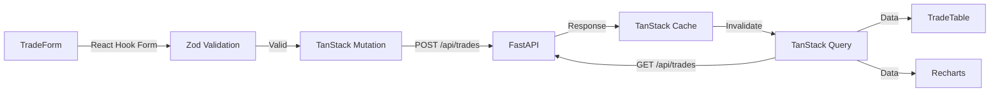

# Design Document: Frontend UI

## Overview

基于 Next.js 14+ App Router 架构的交易复盘系统前端。提供交易录入表单、列表查看、详情展示、动态规则库面板和数据可视化仪表板。

### 核心技术栈

- **Next.js 14+**: App Router, Server Components, Server Actions
- **TypeScript**: 全量类型安全
- **Tailwind CSS**: 原子化 CSS
- **shadcn/ui**: 基于 Radix UI 的组件库
- **React Hook Form + Zod**: 表单管理与验证
- **TanStack Query (React Query)**: 服务端状态管理
- **Recharts**: 图表可视化

### SSR 策略

根据 PRD 要求，不同页面采用不同的渲染策略:

| 页面 | 渲染模式 | 理由 |
|------|---------|------|
| 交易录入表单 | CSR | 重交互、表单状态频繁变更 |
| 交易列表 | SSR + Client Hydration | 首屏加载速度 + 交互筛选 |
| 交易详情 | SSR | 数据读取为主、SEO 无需求但利于分享 |
| 动态规则库 | SSR | PRD 明确要求，确保看到最新数据 |
| 可视化仪表板 | CSR | 图表交互重、数据量大 |
| 系统健康度 | SSR | 数据实时性要求高 |

## Architecture

### 页面路由结构 (App Router)

```
frontend/
├── app/
│   ├── layout.tsx                 # Root layout: 全局导航、主题
│   ├── page.tsx                   # Dashboard 首页
│   ├── trades/
│   │   ├── page.tsx               # 交易列表 (SSR)
│   │   ├── new/
│   │   │   └── page.tsx           # 新建交易 (CSR)
│   │   └── [id]/
│   │       ├── page.tsx           # 交易详情 (SSR)
│   │       └── edit/
│   │           └── page.tsx       # 编辑交易 (CSR)
│   ├── rules/
│   │   └── page.tsx               # 动态规则库 (SSR)
│   ├── analytics/
│   │   └── page.tsx               # 数据可视化 (CSR)
│   └── health/
│       └── page.tsx               # 系统健康度 (SSR)
├── components/
│   ├── ui/                        # shadcn/ui 组件
│   ├── trades/
│   │   ├── TradeForm.tsx          # 分步表单组件
│   │   ├── TradeTable.tsx         # 交易列表表格
│   │   ├── TradeFilters.tsx       # 过滤器面板
│   │   └── TradeDetail.tsx        # 详情展示
│   ├── rules/
│   │   ├── ExclusionList.tsx      # 永久排除清单
│   │   ├── CorrectBehaviors.tsx   # 正确行为清单
│   │   └── MismatchAlerts.tsx     # 环境错配提醒
│   ├── charts/
│   │   ├── PnLCurve.tsx           # 盈亏曲线
│   │   ├── WinRateChart.tsx       # 胜率统计
│   │   └── ErrorDistribution.tsx  # 错误分布
│   └── layout/
│       ├── Navbar.tsx             # 顶部导航
│       └── Sidebar.tsx            # 侧边栏
├── lib/
│   ├── api.ts                     # API 客户端 (fetch wrapper)
│   ├── hooks/
│   │   ├── useTrades.ts           # TanStack Query hooks
│   │   └── useRules.ts            # 规则库 hooks
│   ├── validations/
│   │   └── trade.ts               # Zod schemas
│   └── utils.ts                   # 工具函数
└── types/
    └── trade.ts                   # TypeScript 类型定义
```

### 数据流



### 表单分步设计 (TradeForm)

PRD 要求 "10 分钟快速复盘"，表单分为 4 步:

| 步骤 | 标题 | 主要字段 | 快捷操作 |
|------|------|---------|---------|
| 1 | 基础信息 | account_type, stock_code, stock_name, trade_cycle, entry/exit date/price, position_size | 按钮快选账户类型、周期 |
| 2 | 决策环境 | market_environment, sector_status, selection_dimension, strategy_pattern, thesis_statement | 标签多选、预设模板 |
| 3 | 执行评估 | plan_adherence, stop_loss_discipline, exit_type, exit_reason, psychological_state | 单选快捷按钮 |
| 4 | 归因反思 | result_type, error_level, correct_action, environment_mismatch_flag, permanent_exclusion_flag | 必填 correct_action |

### 草稿自动保存

- 表单填写 >30 秒后自动保存到 localStorage
- Key: `trade_draft_{timestamp}`
- 返回时检测并恢复草稿
- 提交成功后清除草稿

## Components

### API Client (`lib/api.ts`)

```typescript
const API_BASE = process.env.NEXT_PUBLIC_API_URL || 'http://localhost:8000';

export async function apiClient<T>(
  path: string,
  options?: RequestInit
): Promise<T> {
  const res = await fetch(`${API_BASE}${path}`, {
    ...options,
    headers: {
      'Content-Type': 'application/json',
      'X-User-ID': getUserId(),  // V1: simple user identification
      ...options?.headers,
    },
  });
  if (!res.ok) throw new ApiError(res.status, await res.json());
  return res.json();
}
```

### Zod Validation Schemas (`lib/validations/trade.ts`)

与后端 Pydantic 枚举值保持一致（中文）:

```typescript
import { z } from 'zod';

export const accountTypeEnum = z.enum(['短线账户', '中线账户']);
export const tradeCycleEnum = z.enum(['短线', '中线', '长线']);
export const marketEnvEnum = z.enum([
  '牛市-主升', '牛市-调整', '熊市-主跌', '熊市-反弹',
  '震荡市-上轨', '震荡市-下轨', '震荡市-中枢',
]);

export const tradeCreateSchema = z.object({
  account_type: accountTypeEnum,
  stock_code: z.string().min(1).max(20),
  entry_price: z.number().positive(),
  position_size: z.number().positive().max(100),
  correct_action: z.string().min(1),
  // ... other fields
}).refine(
  (data) => !data.exit_date || !data.entry_date || data.exit_date >= data.entry_date,
  { message: '卖出时间必须晚于买入时间' }
);
```

## Error Handling

- TanStack Query 的 `onError` 回调显示 Toast 通知
- 表单验证错误在对应字段下方显示
- 网络超时显示重试按钮
- 403/401 错误重定向到登录页（V2）

## Testing Strategy

- **Vitest**: 单元测试（组件逻辑、hooks）
- **React Testing Library**: 组件渲染测试
- **Playwright**: E2E 测试（表单提交流程）
