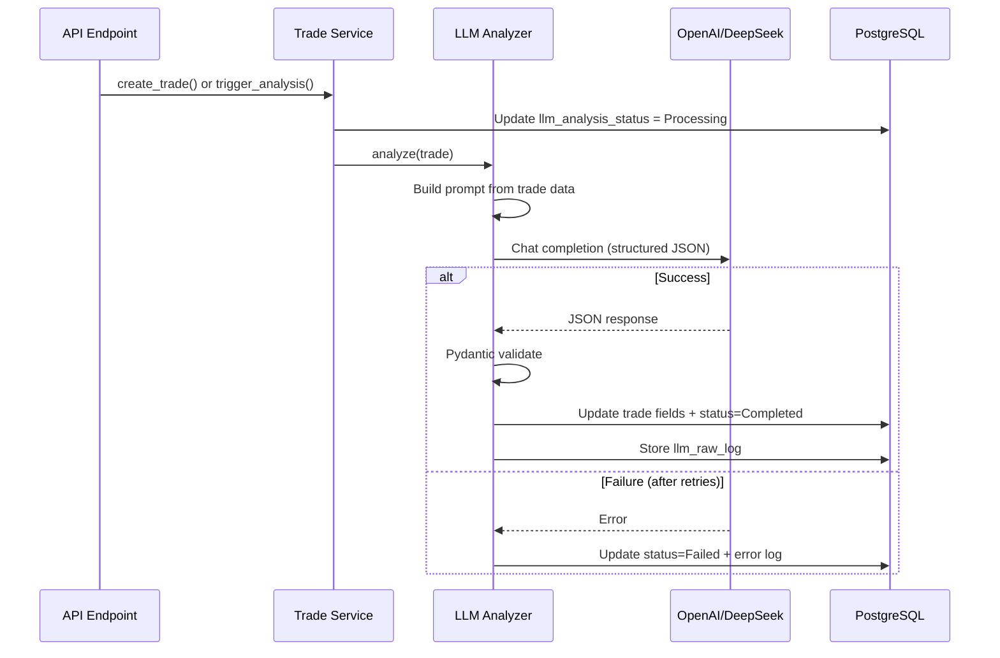

# Design Document: LLM Analysis Engine

## Overview

LLM 分析引擎负责对交易记录进行智能归因分析。通过调用 OpenAI/DeepSeek API，分析买入论点、识别认知偏误、区分技能与运气、检测环境错配，并生成可操作的行动指令。

### 核心技术栈

- **openai**: OpenAI/DeepSeek SDK
- **httpx**: HTTP 客户端 (备用直接调用)
- **celery / asyncio.TaskGroup**: 异步任务处理
- **pydantic**: 结构化输出解析

### 设计原则

1. **Provider 无关**: 通过统一接口抽象 LLM 调用，支持切换 OpenAI/DeepSeek
2. **结构化输出**: Prompt 要求返回固定 JSON Schema，Pydantic 校验
3. **失败安全**: 重试、降级、状态标记，LLM 失败不影响核心 CRUD
4. **成本可控**: Token 计数、缓存、批量优化

## Architecture

### 模块结构

```
backend/app/llm/
├── __init__.py
├── client.py          # LLM API 客户端（Provider 抽象）
├── prompts.py         # Prompt 模板管理
├── schemas.py         # LLM 输出结构化模型 (Pydantic)
├── analyzer.py        # 核心分析引擎
├── cost_tracker.py    # Token 用量和成本追踪
└── tasks.py           # 异步任务 (后台分析)
```

### 分析流程



### LLM 输出结构

```python
class LLMAnalysisResult(BaseModel):
    """LLM 返回的结构化分析结果"""
    # 归因分析
    result_type: ResultType          # 正确盈利/运气盈利/执行亏损/模式亏损
    error_level: Optional[ErrorLevel] # 执行层/模式层/环境层

    # 检测
    environment_mismatch: bool       # 环境错配
    permanent_exclusion: bool        # 永久排除

    # 行动指令
    action_items: list[str]          # 短期可操作行动
    long_term_insights: list[str]    # 长期改进方向

    # 论点分析
    thesis_analysis: str             # 买入论点评估
    cognitive_biases: list[str]      # 识别的认知偏误

    # 置信度
    confidence_score: float          # 0-1 分析置信度
    reasoning: str                   # 推理过程说明
```

### Prompt 模板

```python
TRADE_ANALYSIS_PROMPT = """
你是一位专业的交易分析师。请分析以下交易记录，提供结构化的归因分析。

## 交易数据
- 股票: {stock_code} ({stock_name})
- 买入价: {entry_price}, 卖出价: {exit_price}
- 盈亏: {pnl_amount} ({pnl_ratio}%)
- 市场环境: {market_environment}
- 板块阶段: {sector_status}
- 买入论点: {thesis_statement}
- 执行情况: 计划执行度={plan_adherence}, 止损纪律={stop_loss_discipline}
- 心理状态: {psychological_state}

## 分析要求
1. 判断 result_type: 正确盈利 / 运气盈利 / 执行亏损 / 模式亏损
2. 如有错误，判断 error_level: 执行层错误 / 模式层错误 / 环境层错误
3. 检查是否存在环境错配（在不适合的市场环境下交易）
4. 判断是否属于永久排除行为（绝对错误，无论盈亏都不应该做）
5. 生成具体的行动指令

请严格按照指定 JSON 格式返回。
"""
```

### 重试与降级策略

| 错误类型 | 重试策略 | 降级方案 |
|---------|---------|---------|
| 速率限制 (429) | 指数退避 (2s → 4s → 8s), 最多 3 次 | 标记 FAILED, 稍后重试 |
| 服务端错误 (5xx) | 固定间隔 (5s), 最多 3 次 | 切换备用 Provider |
| 超时 (30s) | 立即重试 1 次 | 标记 FAILED |
| 解析失败 | 不重试 | 存储原始响应, 标记 FAILED |
| 余额不足 | 不重试 | 告警 + 标记 FAILED |

### 成本控制

- 记录每次调用的 prompt_tokens, completion_tokens, total_cost
- 提供日/周/月成本汇总接口
- 对重复的相似交易启用结果缓存
- 批量分析使用 asyncio.gather 并行但限制并发数

## Error Handling

- LLM 分析失败不阻塞交易记录的创建和更新
- 失败时 `llm_analysis_status = Failed`, `llm_raw_log` 存储错误详情
- 提供手动触发重新分析的 API 端点

## Testing Strategy

- 使用 Mock LLM Client 进行单元测试
- Fixture 提供真实 LLM 响应样本
- 属性测试验证任何合法输入都不会导致崩溃
- 集成测试验证完整的分析流程 (使用 mock)
