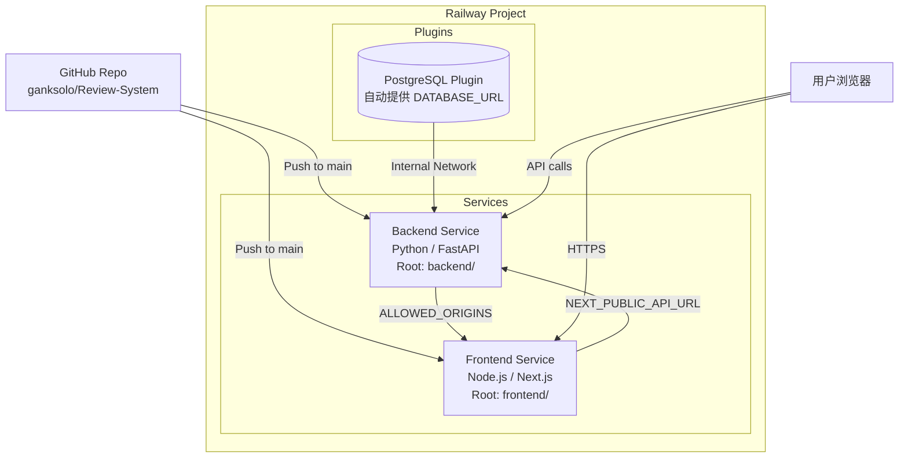
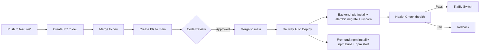

# Design Document: Railway Deployment

## Overview

本文档描述交易复盘系统在 Railway 平台上的部署架构、服务配置和 CI/CD 流程。系统采用 Monorepo 结构，在 Railway 上部署为 3 个独立服务。

## Architecture

### Railway 服务拓扑

### 服务配置

| 服务 | Root Directory | Builder | Start Command |
|------|---------------|---------|---------------|
| **Backend** | `backend/` | Nixpacks (Python) | `alembic upgrade head && uvicorn app.main:app --host 0.0.0.0 --port $PORT` |
| **Frontend** | `frontend/` | Nixpacks (Node.js) | `npm start` |
| **PostgreSQL** | — | Railway Plugin | 自动管理 |

### 内部网络通信

Railway 提供 `.railway.internal` 内部域名:
- Backend 内部地址: `backend.railway.internal:$PORT`
- 如果 Frontend 使用 SSR 调用后端 API，应使用内部地址以降低延迟

### 环境变量配置

#### Backend 服务

| 变量 | 来源 | 说明 |
|------|------|------|
| `DATABASE_URL` | PostgreSQL Plugin (自动) | 需手动改前缀 `postgresql://` → `postgresql+asyncpg://` |
| `ALLOWED_ORIGINS` | 手动设置 | Frontend 公网域名 |
| `PORT` | Railway 自动注入 | 不需手动设置 |
| `LOG_LEVEL` | 手动设置 | `INFO` (生产) |
| `LLM_API_KEY` | 手动设置 | OpenAI/DeepSeek API Key |
| `LLM_MODEL` | 手动设置 | `gpt-4` / `deepseek-chat` |

#### Frontend 服务

| 变量 | 来源 | 说明 |
|------|------|------|
| `NEXT_PUBLIC_API_URL` | 手动设置 | Backend 公网 URL |
| `PORT` | Railway 自动注入 | 不需手动设置 |

### CI/CD Pipeline

### 数据库迁移策略

1. 迁移在 Backend 服务启动前执行 (`Procfile`: `alembic upgrade head && uvicorn ...`)
2. 迁移脚本由 Alembic autogenerate 生成
3. 每次部署自动执行 upgrade，确保 schema 与代码同步
4. 回滚通过 `alembic downgrade -1` 手动执行（紧急情况）

### 零停机部署

Railway 默认支持 rolling deployment:
- 新实例启动并通过健康检查后才切换流量
- 旧实例在流量完全切换后才关闭
- `healthcheckPath = "/health"` 在 `railway.toml` 中配置

### 自定义域名

1. 在 Railway Dashboard → Service → Settings → Domains 添加自定义域名
2. 在 DNS 提供商添加 CNAME 记录指向 Railway 分配的域名
3. Railway 自动申请和续期 Let's Encrypt SSL 证书

### 监控与日志

- Railway 提供内置的日志查看器（实时 stdout/stderr）
- Backend 的 request logging middleware 输出结构化日志
- Health check 端点用于服务健康监控
- 推荐添加外部监控（Sentry for errors, Uptime Robot for availability）

## Error Handling

- 部署失败: Railway 自动回滚到上一个成功版本
- 健康检查失败: 新实例不接收流量，保持旧版本运行
- 数据库连接失败: `/health` 返回 503, Railway 标记为 unhealthy

## Testing Strategy

### 部署前验证
- 在 dev 分支上运行全部测试
- PR 到 main 前确保 CI 通过

### 部署后验证
- 检查 `/health` 端点返回 200
- 检查前端页面正常加载
- 检查 API 文档可访问 (`/docs`)
